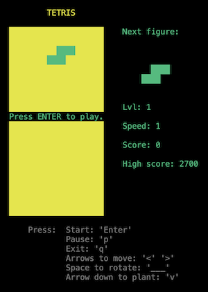
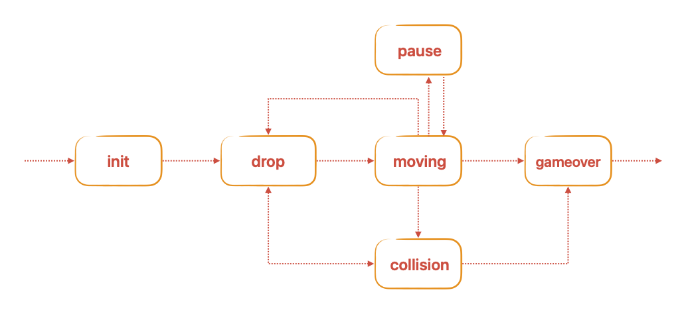

# BrickGame v1.0 aka Tetris
 
  This project is part of the curriculum of [School 21](https://21-school.ru/). 
## Introduction
	
BrickGame v1.0 is a console-based Tetris game developed in C using the
ncurses library. It features classic Tetris gameplay with additional mechanics
such as score counting, level progression, and high score tracking.

The project consists of two parts for implementing the Tetris game: a library that implements the game's logic, which can be connected to various GUIs in the future, and a terminal interface. The logic of the library implemented using finite-state machine.

 
## Features
 - Classic Tetris gameplay with the following mechanics:
    - Rotation of tetrominoes
    - Horizontal movement of tetrominoes
    - Accelerated tetromino falling (by holding the down arrow key)
    - Display of the next tetromino
    - Line clearing
    - Game over when the tetromino reaches the top of the game field
 - Support for all physical buttons on the console:
    - Start new game - Enter
    - Pause - 'p'
    - End game - 'q'
    - Move left -  left arrow
    - Move right -  right arrow
    - Move down - down arrow
    - Rotate - Space
 - Matrix-based game field with dimensions corresponding to the console's size
(10x20 pixels)
 - Proper stopping of tetrominoes after reaching the bottom or colliding with
another tetromino
 - Unit tests for the game logic library, achieving at least 90% code coverage

## Additional mechanics
 
### Score Calculation

- 1 line cleared: 100 points
- 2 lines cleared: 300 points
- 3 lines cleared: 700 points
- 4 lines cleared: 1500 points

### High Score Tracking

- Display of the player's current score and highest score achieved
- Highest score is stored in a file or embedded database and persists between
game sessions
 
### Level Progression

- Progression of levels every 600 points
- Increasing level increases the speed of tetromino falling
 
## Installation

1. Clone the repository.
2. Navigate to the `src/` directory.
3. To install the project run `make install`.
4. To start playing run `make run`.
 
 
## Usage
 
- Use the arrow keys to move and rotate tetrominoes.
- Press the down arrow key to make tetrominoes fall faster.
- Press the up arrow key to rotate tetrominoes.
 
## Fsm Finite State Machine (FSM) Diagram
  A diagram showing the FSM used in the game logic.
	

## Uninstallation

1. Navigate to the `src/` directory.
2. To uninstall the project run `make uninstall`.
 
## Makefile targets:
- **dvi**  
  Creates and open project documentation (using Doxygen).

- **dist**  
  Generates distribution `.tgz` with an executable and necessary documentation.

- **test**  
  Start testing calculator modules and its controller. The report can be viewed in the `/tests/logs` folder.

- **gcov_report**  
  Generates an html report displaying the coverage of all functions by tests.